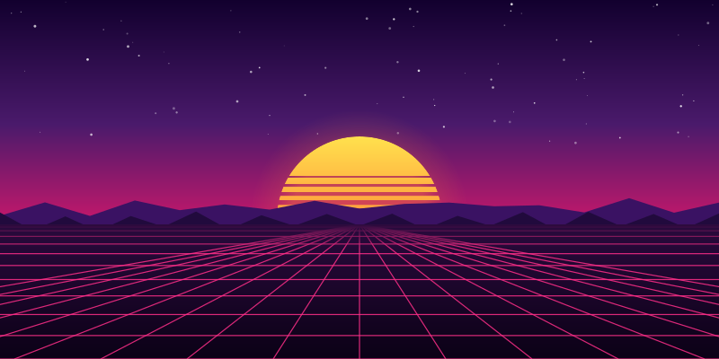
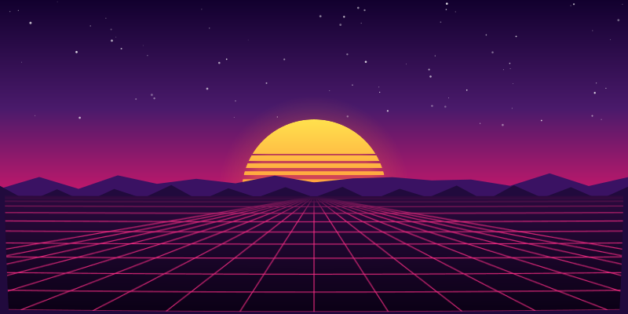

# fancyprofile

给 GitHub profile README 用的 synthwave SVG 背景渲染器。

构建期纯 Node，**不需要浏览器**（上游 `lowlighter/metrics` 要靠 headless Chromium 量高度，
我们靠"位移场是 uv 的纯函数、画布尺寸构建期已知"避开了这一步）。运行时零依赖。



*`npm run scene` — 向前飞行的透视网格，SMIL 驱动，1.8s 无缝循环。*

## 场景

分层是设计要点，不是实现细节：

```text
天空 ─ 星星 ─ 月亮 ─ 山脊 ─ [ 地面：地板 + 网格 ]
                                  ↑ 只有这一层能挂 filter
```

**月亮、山脊、天空永远干净渲染。** 早期版本把 filter 套在整张画布上，结果是月亮必然跟着
一起扭曲。分层之后，扭曲才读得出它本来的物理含义——**地面平面的畸变**，而不是覆盖全图的镜头。





### 太阳样式

圆盘怎么画是一个参数，不是硬编码：`SUN_STYLES = ['bands', 'eclipse', 'rays', 'rings', 'mandala']`。
几何完全共用——同一个圆心、同一个半径、同样被山脊遮掉下半——**不同的只是"光怎么画"**。
（唯一的例外是 `mandala`：它的轮廓是外部资产，被换算到同一个圆盘上。）
（代码和已发布的 id 里这个圆盘叫 `moon`／月亮，指的是同一个东西。）

```sh
npm run scene -- --sun=eclipse   # → scenes/night-drive-eclipse.svg
```

| 样式 | 做法 | 文件 |
|---|---|---|
| `bands` | 默认。横向缺口，越往下越宽 | `night-drive.svg` |
| `eclipse` | 字面的黑太阳：不发光的面、一圈日冕 + 边缘亮环 | `night-drive-eclipse.svg` |
| `rays` | 圆盘背后 24 道楔形光芒（角度是算出来的，2π 处没有接缝） | `night-drive-rays.svg` |
| `rings` | 同心圆缺口，band 的环向版本 | `night-drive-rings.svg` |
| `mandala` | 描摹来的曼陀罗盘：紫色盘面 + 暖色太阳光，24s 自转一圈 | `night-drive-mandala.svg` |







#### mandala：描摹来的紫盘，发的是太阳的光

它是唯一**不是画出来**的样式：轮廓是一份描摹资产（`src/sun-mandala.path.txt`，25 条子路径、
11kB 三位小数的机器输出），`src/sun-mandala.mjs` 在构建期把它**换算**到圆盘上，而不是编辑它——
外边界拟合出的圆决定缩放，坐标压到输出分辨得清的精度、编码成相对坐标（7.8kB → 5.9kB）。
拟合残差在构建期断言（超过半径的 0.2% 就报错）：描摹的圆不是精确的圆，绕着它转会有看不出来的晃动。

紫色的**是盘面**，不是光。它发出的是场景里那束太阳光（同一个 `corona` / `moonGlow` 斜坡），
所以格子之间的洞是暖的、盘本身是紫的——紫色的盘再发紫光，读起来是贴纸，不是太阳。

它也是 banner 里唯一**自己会动**的东西，24s 一圈，与 1.8s 的地面循环刻意不同频：同步的太阳会被
读成镜头的一部分，而不是远处一个自己在转的物体。转动里最坑的一条是实测出来的——**光不能跟着转**：
`userSpaceOnUse` 说的是「引用它的那个元素的用户空间」，不是「页面」，所以渐变挂在旋转组里的 `<path>`
上就会跟着一起转，太阳转一圈、明暗也走一圈（同一像素 0° 是 `#a058e1`，90° 变成 `#5d22a4`）。
现在盘面由静止的 `<rect>` 上色、形状在 `<mask>` 里转，两件事分开。

`bands` 保持默认，因为它是已发布的 banner，**必须字节不变**——换样式的实验落在兄弟文件里，
永远覆盖不了它。五个样式都在 `npm run verify` 的覆盖范围内，理由和实验图一样：一个不再是默认值的
样式，是最容易悄悄烂掉的东西。

## 工具层

`src/svg.mjs` 是一个薄的 SVG builder：不建树、不做渲染抽象，只保证两类**真实踩过的** bug
在类型上无法表达。

- **非法 path data** —— 山脊曾经因为路径以坐标对而非 moveto 开头，被浏览器**静默丢弃**，
  在每一帧里都不存在。而像素对比永远发现不了：所有帧都一样地没有山。
- **未转义的属性值**

属性名原样透传，必须按 SVG 的写法给（`stroke-width` 用 kebab，`viewBox` / `baseFrequency`
用 camel）。**不做命名转换——猜错是静默的。**

| 文件 | 职责 |
|---|---|
| `src/svg.mjs` | SVG builder：元素、路径、渐变、filter primitive |
| `src/scene.mjs` | 分层背景场景 + 位移 filter |
| `src/displacement.mjs` | shader 位移场 → RG 贴图 |
| `src/png.mjs` | 最小 RGBA8 PNG 编解码，只用内置 `zlib` |
| `src/sun-mandala.mjs` | 描摹轮廓 → 圆盘坐标：拟合圆心、定精度、相对编码 |

### 位移管线

```text
fragment(uv) → dx, dy → R=dx/scale+0.5, G=dy/scale+0.5 → PNG → base64 data URI
                                                              ↓
                                                    feImage → feDisplacementMap
```

技术来自 `shuding/svg-shaders`（见 `docs/research-plan.md`），但搬到了构建期：
位移场是 uv 的纯函数，编码是算术，**整条链路不需要 canvas 也不需要浏览器**。

两个不能省的细节：`color-interpolation-filters="sRGB"`（默认的 linearRGB 会把编码好的
偏移量过一遍传递曲线），以及 `scale` 必须和编码时的归一化系数一致，且**以 filter 的
user space 为单位**——用地图像素算会让低分辨率的地图变成"位移更弱"而不是"更平滑"。

## GitHub 渲染边界（实测，非推测）

完整记录见 [`docs/findings-github-svg.md`](docs/findings-github-svg.md)。

- GitHub 对仓库内 SVG **不做净化**：逐字节原样返回，`image/svg+xml`。约束全在浏览器把
  SVG 当 `` 加载时的 secure static mode
- 该模式下实测可用：filter primitive、**`feImage` 带 data: URI**（这套技术的命门）、
  SMIL `<animate>`、`animateTransform`（这一条是本地 `` 上下文补测的，见 docs）、
  文档内 `<style>` + `@keyframes`、`<mask>`
- **不可用**：`backdrop-filter` —— 只能扭曲自己被画出来的样子，不能折射背后的内容

六个隔离变量的实验：

| # | 文件 | 验证的能力 |
|---|------|-----------|
| 01 | `01-baseline.svg` | 仓库内 SVG 能否被渲染（基线） |
| 02 | `02-smil.svg` | SMIL 声明式动画 |
| 03 | `03-css.svg` | 文档内 `<style>` + `@keyframes` |
| 04 | `04-turbulence.svg` | filter primitive（不含 `feImage`） |
| 05 | `05-feimage.svg` | `feImage` + `feDisplacementMap`，`href` |
| 06 | `06-feimage-xlink.svg` | 同上，`xlink:href` |

每个 filter 都只挂在地面层上——这既是场景的真实结构，也让实验更严格：六张图里月亮都是
干净的，所以 filter 坏掉表现为"地面不对"而不是"整张画不对"。

### svgo

`preset-default` 的五个危险插件没弄坏任何东西（我们没踩到触发条件），收益也接近零：
小文件 -23%，而真正的产物只有 **-1.3%**，因为绝大部分字节是 base64 位移场。
想拿它当净化器用的话 `removeScripts` **不在** preset 里，必须显式加。

## 构建

```sh
npm ci
npm run build      # 生成 experiments/ 六个 SVG
npm run scene      # 生成 scenes/ 的 banner；--sun=<style> 换太阳样式
npm run verify     # 重建并校验与已提交的一致（6 个实验 + 5 个太阳样式）
```

`verify` 比的是**语义**不是字节：zlib 的 deflate 输出跨版本不稳定，CI 上（Node 24）和本地
（Node 26）的 base64 长度不同、解码后像素完全相同。所以它比 (a) 掩掉 payload 的 markup 和
(b) 解码后的位移场像素。比字节会在一个并不存在的差异上失败——第一版 CI 就是这么红的。

它覆盖的不只是实验图，也包括 `scenes/` 里的 banner 和四种备选太阳样式：README 引用的资产一旦
过期，就是文档在撒谎，而"样式"这种东西恰恰是在它不再是默认值之后开始悄悄烂掉的。

其余脚本都是**决策工具**，产物落在 `experiments/` 下且不入库（见 `.gitignore`）：

| 命令 | 用途 |
|---|---|
| `npm run look` | warp 强度梯度，用眼睛定 |
| `npm run compression` | 位移场分辨率/通道扫描 |
| `npm run probe` | 单竖线探针，直接量位移落点 |
| `npm run svgo` | 四个逐级关插件的 svgo 配置对比 |

`reference/` 是上游仓库的 shallow clone，已 gitignore。
