# fancyprofile

给 GitHub profile README 用的 synthwave SVG 渲染器。

现阶段只在确认一件事：**GitHub 到底允许 README 里的 SVG 用哪些能力**。下面每个文件只隔离一个
变量，所以页面上哪个没渲染出来，就能直接定位到原因，而不是笼统的「SVG 没生效」。

| # | 文件 | 验证的能力 |
|---|------|-----------|
| 01 | `01-baseline.svg` | 仓库内 SVG 能否被渲染（基线） |
| 02 | `02-smil.svg` | SMIL 声明式动画（`<animate>`）是否保留 |
| 03 | `03-css.svg` | 文档内 `<style>` + `@keyframes` 是否保留 |
| 04 | `04-turbulence.svg` | filter primitive 是否可用（不含 `feImage`） |
| 05 | `05-feimage.svg` | `feImage` + `feDisplacementMap`，`href` 写法 |
| 06 | `06-feimage-xlink.svg` | 同上，`xlink:href` 写法 |

## 实测结果

2026-09-28 实测（`docs/findings-github-svg.md` 是完整记录）：

- GitHub **原样返回**仓库内 SVG，六个文件 sha256 与本地逐字节相同，不做净化
- 约束全在浏览器把 SVG 当 `` 加载时的 secure static mode

| # | 能力 | 结果 |
|---|------|------|
| 01 | 基线 | ✅ |
| 02 | SMIL `<animate>` | ✅ 动画在跑 |
| 03 | `<style>` + `@keyframes` | ✅ 动画在跑 |
| 04 | filter primitive | ✅ 13.1% 像素偏离基线 |
| 05 | `feImage` data: URI + `feDisplacementMap` | ✅ 16.7% 像素偏离基线 |
| 06 | 同上，`xlink:href` | ✅ 与 05 等价 |

结论：`shuding/svg-shaders` 那套位移贴图技术**可以在 README 里离线预计算后使用**。

已知边界：`backdrop-filter`（`liquid-glass` 真正的手法）在 `` 里不可用 —— 只能扭曲自己被
画出来的样子，不能折射背后的内容。

### 01 基线


### 02 SMIL 动画


### 03 CSS 动画


### 04 feTurbulence + feDisplacementMap


### 05 feImage + feDisplacementMap（href）


### 06 feImage + feDisplacementMap（xlink:href）


## 构建

```sh
npm ci
npm run build
```

`npm run verify` 重新构建并检查 `experiments/` 有无 diff —— CI 靠它保证提交进仓库的 SVG 和
源码一致，防止有人手改生成物。

## 目录

- `src/` — 可复用部分
  - `png.mjs` — 最小 RGBA8 PNG 编码器，只用内置 `zlib`，零依赖
  - `displacement.mjs` — shader 位移场 → RG 贴图 → `feDisplacementMap`
  - `scene.mjs` — synthwave 场景的 SVG markup
  - `build-experiments.mjs` — 生成上面那六个文件
- `docs/research-plan.md` — 上游源码研究计划
- `reference/` — 上游仓库的 shallow clone（已 gitignore，不提交）
