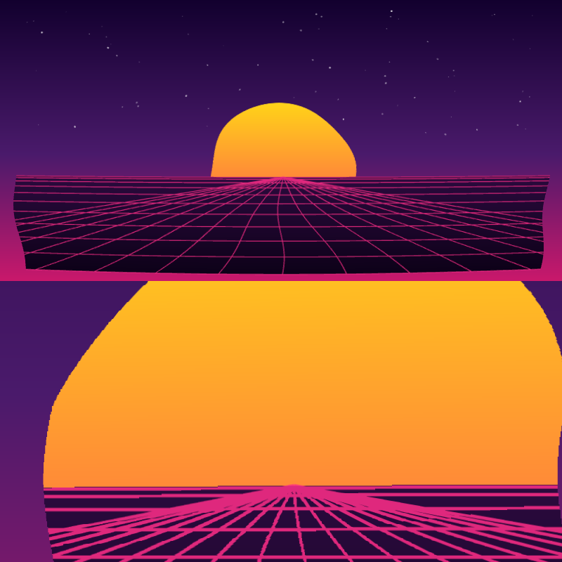
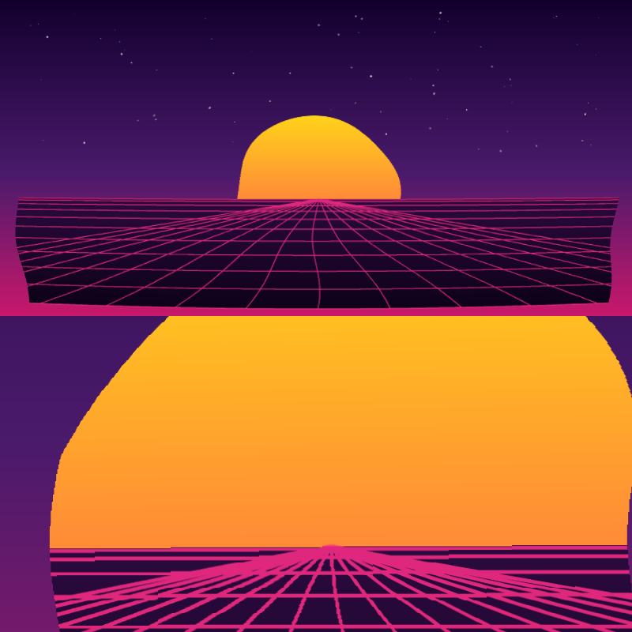
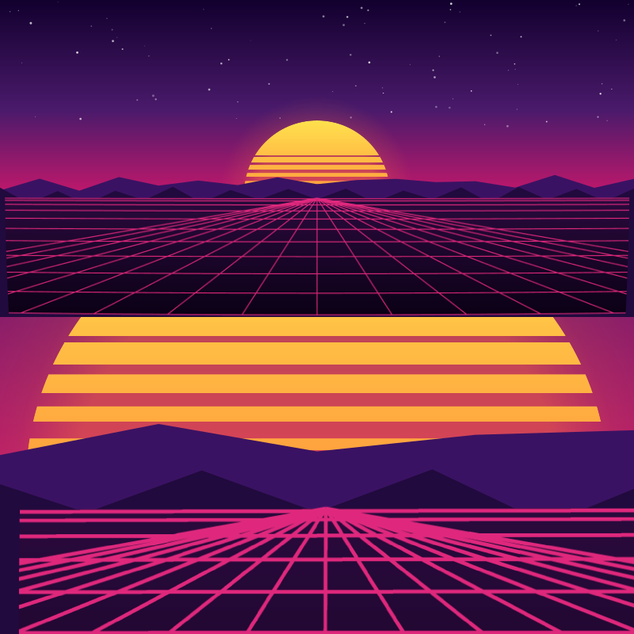

# fancyprofile

给 GitHub profile README 用的 synthwave SVG 渲染器。

现阶段只在确认一件事：**GitHub 到底允许 README 里的 SVG 用哪些能力**。下面每个文件只隔离一个
变量，所以页面上哪个没渲染出来，就能直接定位到原因，而不是笼统的「SVG 没生效」。

| # | 文件 | 验证的能力 |
|---|------|-----------|
| 01 | `01-baseline.svg` | 仓库内 SVG 能否被渲染（基线） |
| 02 | `02-smil.svg` | SMIL 声明式动画（`<animate>`）是否保留 |
| 03 | `03-css.svg` | 文档内 `<style>` + `@keyframes` 是否保留 |
| 04 | `04-turbulence.svg` | filter primitive 是否可用（不含 `feImage`） |
| 05 | `05-feimage.svg` | `feImage` + `feDisplacementMap`，`href` 写法 |
| 06 | `06-feimage-xlink.svg` | 同上，`xlink:href` 写法 |

## 实测结果

2026-09-28 实测（`docs/findings-github-svg.md` 是完整记录）：

- GitHub **原样返回**仓库内 SVG，六个文件 sha256 与本地逐字节相同，不做净化
- 约束全在浏览器把 SVG 当 `` 加载时的 secure static mode

| # | 能力 | 结果 |
|---|------|------|
| 01 | 基线 | ✅ |
| 02 | SMIL `<animate>` | ✅ 每 1.2s 有 0.58% 像素变化，稳定复现 |
| 03 | `<style>` + `@keyframes` | ✅ 每 1.2s 有 ~14.8% 像素变化 |
| 04 | filter primitive | ✅ 13.1% 像素偏离基线 |
| 05 | `feImage` data: URI + `feDisplacementMap` | ✅ 16.7% 像素偏离基线 |
| 06 | 同上，`xlink:href` | ✅ 与 05 等价 |

结论：`shuding/svg-shaders` 那套位移贴图技术**可以在 README 里离线预计算后使用**。

已知边界：`backdrop-filter`（`liquid-glass` 真正的手法）在 `` 里不可用 —— 只能扭曲自己被
画出来的样子，不能折射背后的内容。

### svgo

`preset-default` 的五个危险插件**没弄坏任何文件**（我们没踩到触发条件），但收益也几乎为零：
小文件 -23%，真正的产物只有 **-1.3%**，因为 98% 是 base64 位移场。想当净化器用的话
`removeScripts` 不在 preset 里，得显式加。

### 位移场压缩

| 地图分辨率 | SVG 总大小 | vs 全分辨率 |
|-----------|-----------|------------|
| 800×400 | 132.1 kB | — |
| 400×200 | 74.4 kB | 3.29% |
| **200×100** | **36.6 kB** | 3.93% |
| **100×50** | **18.0 kB** | 5.32% |
| 50×25 | 11.2 kB | 7.44% |
| 25×13 | 9.0 kB | 10.04% |

单竖线探针证明**六种分辨率位移完全一致**（落点都是 108，理论值 109）；放大差异图显示均匀区域
逐像素纯黑，差异只在边缘的亚像素位置。百分比高是因为画面全是 1.2px 细线，指标被放大。

RGB（3 通道）方向砍掉：只省 2.5% 字节，却引入 2.74% 渲染差异，而两张 PNG 解码后逐字节相同。

### 分辨率复核（需要人眼定夺）

像素指标定不了这件事：它报 3~10%，但放大差异图显示差异全是 **1.2px 细线上的亚像素位移**，
均匀区域逐像素相同。够不够看取决于显示尺寸，只有真实 README 能回答。

下面每个文件上下两栏**共用同一张位移场**：
- **上栏 = 原始尺寸** —— GitHub 会缩到 ~760px，就是读者实际看到的
- **下栏 = 4 倍放大** —— 太阳边缘 + 地平线 + 密集网格汇聚处，平滑化最先在这里显形

判据：如果上栏几档看不出差别、只有下栏有，那这一档就够用。

**800×400 — 当前，139kB**



**200×100 — 保守，43kB**



**100×50 — 激进，24kB**



### 01 基线


### 02 SMIL 动画


### 03 CSS 动画


### 04 feTurbulence + feDisplacementMap


### 05 feImage + feDisplacementMap（href）


### 06 feImage + feDisplacementMap（xlink:href）


## 构建

```sh
npm ci
npm run build
```

`npm run verify` 重新构建并检查 `experiments/` 有无 diff —— CI 靠它保证提交进仓库的 SVG 和
源码一致，防止有人手改生成物。

## 目录

- `src/` — 可复用部分
  - `png.mjs` — 最小 RGBA8 PNG 编码器，只用内置 `zlib`，零依赖
  - `displacement.mjs` — shader 位移场 → RG 贴图 → `feDisplacementMap`
  - `scene.mjs` — synthwave 场景的 SVG markup
  - `build-experiments.mjs` — 生成上面那六个文件
- `docs/research-plan.md` — 上游源码研究计划
- `reference/` — 上游仓库的 shallow clone（已 gitignore，不提交）
